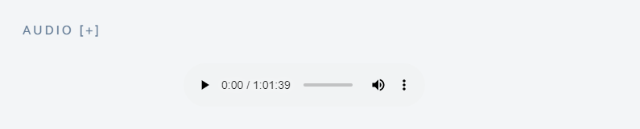
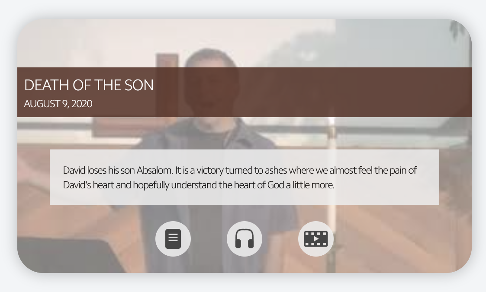

# amazing-grace-pdx

A set of scripts and resources for amazinggracepdx.com

# Data

The data consists of a group of sermon messages. 

## Usage
The Data is used in several places on the website for links and embedded media players.

For more details, see [Web Pages](#Web-Pages)

## Data Format

As of now, the main "database" for the website is stored as a JSON file *message_details.json*. This file contains one element for every message, each containing details and links to a YouTube video, audio file, and notes. The data is keyed by date, using the format *YYYY-MM-DD*. 

```json
{    
    "2019-03-31" : {
        "title": "The Story of the World",
        "videoId": "3Q7foYHXzVA",
        "playlistId": "m4931EJqwZp5YhyYNW",
        "description": "Luke 15:11-32",
        "messageStart": 212,
        "tags" : [],
        "audioLink": "https://drive.google.com/open?id=1SRmP2cyPp9m1msiTJoEwMTQoWQh3mgBz",
        "audioDownloadLink": "https://drive.google.com/uc?export=download&id=1SRmP2cyPp9m1msiTJoEwMTQoWQh3mgBz",
        "notesLink": "https://www.dropbox.com/sh/3zn82x1orun0hx7/AABIXfs-vRMBlZZdskhacMWDa/Miscellaneous%202019?dl=0&lst=&preview=Luke+15.11-32+Lost+Sons+Branches+Notes.pdf&subfolder_nav_tracking=1"
    },
    "2019-04-07" : {
        "title": "What's Worth Pursuing in Life",
        "videoId": "KDvKC0hfGQc",
        "playlistId": "m4931EJqwZp5YhyYNW",
        "description": "Philippians 3:7-16",
        "messageStart": 276,
        "tags" : [],
        "audioLink": "https://drive.google.com/open?id=1v-5qP4VcCaieNSk2lvKcgMiCsgp24nTg",
        "audioDownloadLink": "https://drive.google.com/uc?export=download&id=1v-5qP4VcCaieNSk2lvKcgMiCsgp24nTg",
        "notesLink": "https://www.dropbox.com/sh/3zn82x1orun0hx7/AABIXfs-vRMBlZZdskhacMWDa/Miscellaneous%202019?dl=0&lst=&preview=Philippians+3.7-16+Branches+Notes.pdf&subfolder_nav_tracking=1"
    },
    ...
}
```

### Message Details

* *title* - The title of the message
* *description* - A short description of the message. This usually includes the Bible passage. On the website, the contents of this field are displayed  when hovering over the title in message series pages.

### Video Details

* *videoId* - The YouTube video ID
* *playlistId* - The YouTube playlist ID
* *messageStart* - The time in seconds at which the message portion of the video begins. This is used to provide controls to seek to the start of the service or beginning of the message.
* *tags* - Unused

### Audio Details

* *audioLink* - The complete URL to the message audio for streaming. This link is used for the [message series](#Message-Series-Pages) page.
* *audioDownloadLink* - The complete URL to the message audio for downloading. This is primarily used for the [main message](#Messages-Front-Page) page's audio widget.

### Notes Details
* *notesLink* - The complete URL to the message notes

# Scripts

* *load_message_details.js*<br>*load_youtube_iframe.js*
    * Provide functions for loading either *message_details.json* or the YouTube IFrame API
    * Provide functions for attaching callbacks for when the above resources are available.

* *latest_message_video.js*<br>
  *latest_message_audio.js*<br>
  *latest_message_notes.js*
    * Pull the latest data block (determined by the date key) that has a non-empty field for the message video, audio, or notes field, depending on the script.
    * When the data is loaded, the script injects it into the various elements on the message front page.
    * **All three require *load_message_details.js***
    * ***load_message_video.js* additionally requires *load_youtube_iframe.js***

* *message_series.js*
    * Like the above three scripts, but used for the message series pages to inject details into "message blocks", which are HTML \<div> elements - one for each message in the series.
    * **Requires *load_message_details.js***

* *message_front_page.js* 
    * Deprecated

* *barrier.js*
    * Provides a utility function to *barrier*, or wait until, multiple resources are available before proceeding.

# CSS

Our site has a custom CSS style sheet - *global_style.css*. This provides styles for various custom elements to match the default website's element styles.

To accomplish this, a root style is provided that can be overriden on a per-page basis to allow for custom color schemes.

```css
:root {
    --bg-color-primary: #F9AF0D;
    --fg-color-primary: #FFFFFF;
    --border-color-primary: #00000000;
    --shadow-color: #F7B00680;
    --hover-bg-color: #FEE0AC;
    --active-bg-color: var(--bg-color-primary);
    --disabled-bg-color: lightgrey;
    --disabled-fg-color: grey;
    --disabled-border-color: darkgrey;
}
```
By providing a `:root{}` block in the page's custom CSS section, any one or more of these fields can be overriden.

# Code Injection

The website that manages amazinggracepdx.com (nucleus.church) provides the ability to inject code into every page. We use this to inject Google Analytics, JQuery, our custom CSS, and a few custom scripts.


This is our code injection block as of writing this:

```HTML
<!-- Global site tag (gtag.js) - Google Analytics -->
<script async src="https://www.googletagmanager.com/gtag/js?id=UA-66147796-1"></script>
<script>
    window.dataLayer = window.dataLayer || [];
    function gtag(){dataLayer.push(arguments);}
    gtag('js', new Date());

    gtag('config', 'UA-66147796-1');
</script>

<!-- JQuery -->
<script src="https://code.jquery.com/jquery-3.3.1.min.js" integrity="sha256-FgpCb/KJQlLNfOu91ta32o/NMZxltwRo8QtmkMRdAu8=" crossorigin="anonymous"></script>

<!-- Taylor's CSS -->
<link rel="stylesheet" href="https://amazinggracepdx.netlify.com/global_style.css">

<!-- Taylor's scripts -->
<script type="text/javascript" src="https://amazinggracepdx.netlify.com/barrier.js"></script>
<script type="text/javascript" src="https://amazinggracepdx.netlify.com/load_message_details.js"></script>
<script type="text/javascript" src="https://amazinggracepdx.netlify.com/load_youtube_iframe_api.js"></script>
```
**Note that the latter two load scripts only provide functions for loading resources - they don't actually initiate the load. See example in 
[Messages Front Page](##Messages-Front-Page)**

# Web Pages 

## Messages Front Page

This page contains links and embedded media players for the latest message video, audio, and notes. Each element consists of a `<div>` element that contains and `id` specifying its type and a `<script>` element to bind the data to it. For simplicity, in the website editor, each of the video, audio, and notes elements are contained in separate HTML blocks.

### Video Block

```html
<div align="center" class="" >
    <!-- YouTube iframe container -->
    <div class="ag-embed-responsive">
        <div id="latest-message-video" class="ag-embed-responsive-item"></div>
    </div>

    <!-- Controls for the YouTube player -->
    <div id="latest-message-video-controls" class="ag-btn-group ag-center" role="group" aria-label="Player controls">
        <button id="latest-message-video-controls-jump-to-beginning" type="button" class="ag-btn ag-btn-round">Jump To Beginning</button>
        <button id="latest-message-video-controls-jump-to-message" type="button" class="ag-btn ag-btn-round">Jump To Message</button>
    </div>
</div>
<script type="text/javascript" src="https://amazinggracepdx.netlify.com/latest_message_video.js"></script>
```


### Audio Block

```html
<div id="latest-message-audio" class="ag-center"></div>

<script type="text/javascript" src="https://amazinggracepdx.netlify.com/latest_message_audio.js"></script>
```




### Notes Block

```html
<div id="latest-message-notes" class="ag-center"></div>

<script type="text/javascript" src="https://amazinggracepdx.netlify.com/latest_message_notes.js"></script>
```


### Load Block

One final HTML block is required to be placed after all the other blocks. This block contains a simple `<script>` element that calls the *load* functions that acquire the data resources. At this point, all of the other scripts will have registered their callbacks with the relevant data loaders, so upon acquisition of the resources, each element will be populated.

```html
<script>
loadMessageDetails();
loadYouTubeIframeAPI();
</script>
```

This block requires *load_message_details.js* and *load_youtube_iframe.js* to be loaded before hand. This is done automatically by the [code injection](#Code-Injection).


The end result can be seen here: http://amazinggracepdx.com/messages-1

## Message Series Pages

Each message series has its own page. Each message in the series is is represented as a title with links to the video, audio, and notes.


The message series page is made up of two HTML blocks. The first is a section containing one `<div>` element for each message. The `class` must be `"message-block"`, and the `id` must be a date that matches a key in the database for the message. 

### Message Blocks

```html
<div id="2019-02-03" class="message-block"></div>
```

Multiple `<div>` elements may be placed on after the other to form a list of messages for the series.

```html
<div id="2019-02-03" class="message-block"></div>
<div id="2019-02-10" class="message-block"></div>
<div id="2019-02-17" class="message-block"></div>
<div id="2019-02-24" class="message-block"></div>
<div id="2019-03-10" class="message-block"></div>
```
### Load Block

In order for the data to be bound to the `<div>` elements, you must load the *load_message_series.js* script after the last element. 

```html
<script type="text/javascript" src="https://amazinggracepdx.netlify.com/message_series.js"></script>
```
This block requires *load_message_details.js* to be loaded before hand. This is done automatically by the [code injection](#Code-Injection).

For any missing link in the details for any particular message, the button for that link will be greyed out and disabled.

The end result can be seen here:
http://amazinggracepdx.com/jesus-mountainside-message

# A note on Netlifly

You may have noticed that the scripts are being loaded from https://amazinggracepdx.netlify.com. The way GitHub exposes its files, it  is non-trivial to load a javascript file as a script. To mitigate this, we use Netlifly which exposes GitHub repositories as web sites. Netlifly can serve an entire website, but  we only use it as a way to serve our scripts.


# Tutorial: Weekly upload

## Overview

1. [Upload video, audio, and notes](#Upload-video,-audio,-and-notes)
2. [Add details to *message_details.json*](#Add-details)
3. [Publish the changes](#Publish-the-changes)

## Upload video, audio, and notes

* Video
    * Trim the video to capture the entire service
        * Start at introduction before first hymn
        * End just after the announcments
        * Don't include music videos before or after the service
        * Name the file according to the format ***YYYY-MM-DD*_service.mp4**
    * Upload video to YouTube using Amazing Grace's account
        * Set the *Title* according to the format **MM.DD.YYYY Title**
        * Set the *Description* to include the Bible passage(s) and optionally a short description of the message
        * Set the *Playlist* to the sermon series name
        * Set the *Recording Date* to the date of the service
        * Make sure the *Visibility* is *Public*
        * Add any *Tags* that pertain to the service.

* Audio
    * Trim audio to capture just the sermon message
        * Name the file according to the format ***YYYY-MM-DD*_sermon.mp3**
    * Upload the file to Amazing Grace's Google Drive folder under **Sermon Audios/*Series Name***

* Notes
    * Notes should be uploaded as a PDF
        * Pastor usually takes care of this

## Add the details to the database

This tutorial assumes you have set up the sermon series in *message_details.json* ahead of time, so you should have an existing block for each message in the sermon series. We'll focus on just the block for this message

```json
 "2019-06-23" : {
        "title": "The Seeds We Sow",
        "videoId": "",
        "playlistId": "",
        "description": "2 Samuel 3:2-39",
        "messageStart": 0,
        "tags" : [],
        "audioLink": "",
        "audioDownloadLink": "",
        "notesLink": ""
    },
```
As-is, this message block is ready for the website. The title and description will be functional if a matching `<div>` exists on a series web page. The video, audio, and notes buttons will be disabled since all the links are empty.


### Gather the details

Get the video ID from the YouTube video URL:
https://www.youtube.com/watch?v=<mark>mWH1jVwcjuM</mark>

Get the playlist ID from the playlist's URL: https://www.youtube.com/watch?v=mWH1jVwcjuM&list=<mark>PLfBOebmxfChGt7oRuCD2MvX_ZB3WltQE7</mark>

Find out what time the message starts (usually after the first hymn). In this case, the message starts at 3:45, so the start time for the JSON data will be **225**.

From the Google Drive web interface, get the link for the audio file by right-clicking on the file and selecting **Get shareable link**


This will give you the link to play the file:
https://drive.google.com/open?id=1ThZTdv-HXmDYuqLZxszIQMECSgffpgWA

To get the *download* link, take the ID from the above link and insert it into this URL: 


Fill in the details for all the resources, and it should look like this: 
https://drive.google.com/uc?export=download&id=<mark>1ThZTdv-HXmDYuqLZxszIQMECSgffpgWA</mark>

This link will initiate a download instead of playing the file. This link is used by the [front page](#Messages-Front-Page) for the embedded audio player.

### Update the JSON file

```json    
"2019-06-23" : {
        "title": "The Seeds We Sow",
        "videoId": "mWH1jVwcjuM",
        "playlistId": "PLfBOebmxfChGt7oRuCD2MvX_ZB3WltQE7",
        "description": "2 Samuel 3:2-39",
        "messageStart": 225,
        "tags" : [],
        "audioLink": "https://drive.google.com/open?id=1ThZTdv-HXmDYuqLZxszIQMECSgffpgWA",
        "audioDownloadLink": "https://drive.google.com/uc?export=download&id=1ThZTdv-HXmDYuqLZxszIQMECSgffpgWA",
        "notesLink": "https://www.dropbox.com/sh/3zn82x1orun0hx7/AAAKloonCx5bcVMKz6-Fetopa/David%20Long%20Live%20the%20King?dl=0&preview=Notes+2+Samuel+3.2-39+Seeds+We+Sow.pdf&subfolder_nav_tracking=1"
       },
```

## Publish the changes

### Validate the JSON file

If the JSON file is improperly formatted, no data will be available to the website, and all message links will be broken (that's bad!). To prevent this from happening, you can check the JSON file with an online JSON validator. I use https://jsonlint.com/.


### Publish

Once you've updated *message_details.json*, commit the file to this repo and push it. You can either edit the file through the GitHub in-browser editor or push the commit using an external GIT client.

Once published to the master branch, the changes will be live on the website.



Result: http://amazinggracepdx.com/david-long-live-the-king 

# Tutorial: Adding a new series

## Overview

1. [Create a new card](#Create-a-new-card)
2. [Add HTML blocks for the messages](#Add-HTML-blocks)
2. [Add placeholders in the database](#Add-placeholders-in-the-database)
3. [Publish the changes](#Publish-the-changes)

## Create a new card

-- TODO -- 

## Add HTML blocks

Add two HTML blocks - one for the message `<div>` elements, and one for the `<script>` element.


### Message block `<div>` elements


HTML block code:
```html
<div id="2019-06-16" class="message-block"></div>
<div id="2019-06-23" class="message-block"></div>
<div id="2019-06-30" class="message-block"></div>
<div id="2019-07-07" class="message-block"></div>
<div id="2019-07-14" class="message-block"></div>
<div id="2019-07-21" class="message-block"></div>
<div id="2019-07-28" class="message-block"></div>
<div id="2019-08-04" class="message-block"></div>
<div id="2019-08-11" class="message-block"></div>
<div id="2019-08-18" class="message-block"></div>
```
### Load `<script>` element


## Add placeholders in the database

Now add one element per message to the database (*message_details.json*), making sure to fill in at least the *date* key, *title*, and *description*.

```json
    "2019-06-16" : {
        "title": "God's Where, God's When",
        "videoId": "",
        "playlistId": "",
        "description": "",
        "messageStart": 0,
        "tags" : [],
        "audioLink": "",
        "audioDownloadLink": "",
        "notesLink": ""
    },
    "2019-06-23" : {
        "title": "The Seeds We Sow",
        "videoId": "",
        "playlistId": "",
        "description": "2 Samuel 3:2-39",
        "messageStart": 0,
        "tags" : [],
        "audioLink": "",
        "audioDownloadLink": "",
        "notesLink": ""
       },
    "2019-06-30" : {
        "title": "Long Live the King!",
        "videoId": "",
        "playlistId": "",
        "description": "2 Samuel 5:1-16",
        "messageStart": 0,
        "tags" : [],
        "audioLink": "",
        "audioDownloadLink": "",
        "notesLink": ""
    },
    "2019-07-07" : {
        "title": "David's Mighty Men",
        "videoId": "",
        "playlistId": "",
        "description": "2 Samuel 5:17-25, 23:8-39",
        "messageStart": 0,
        "tags" : [],
        "audioLink": "",
        "audioDownloadLink": "",
        "notesLink": ""
    },
    "2019-07-14" : {
        "title": "Can Man Live With God?",
        "videoId": "",
        "playlistId": "",
        "description": "2 Samuel 6:1-11",
        "messageStart": 0,
        "tags" : [],
        "audioLink": "",
        "audioDownloadLink": "",
        "notesLink": ""
    },
    "2019-07-21" : {
        "title": "David's Dance",
        "videoId": "",
        "playlistId": "",
        "description": "2 Samuel 6:12-23",
        "messageStart": 0,
        "tags" : [],
        "audioLink": "",
        "audioDownloadLink": "",
        "notesLink": ""
    },
    "2019-07-28" : {
        "title": "David's Son, David's Lord",
        "videoId": "",
        "playlistId": "",
        "description": "2 Samuel 7:1-17",
        "messageStart": 0,
        "tags" : [],
        "audioLink": "",
        "audioDownloadLink": "",
        "notesLink": ""
    },
    "2019-08-04" : {
        "title": "David's Prayer",
        "videoId": "",
        "playlistId": "",
        "description": "2 Samuel 7:18-29",
        "messageStart": 0,
        "tags" : [],
        "audioLink": "",
        "audioDownloadLink": "",
        "notesLink": ""
    },
    "2019-08-11" : {
        "title": "Power and Promise",
        "videoId": "",
        "playlistId": "",
        "description": "2 Samuel 8-9",
        "messageStart": 0,
        "tags" : [],
        "audioLink": "",
        "audioDownloadLink": "",
        "notesLink": ""
    },
    "2019-08-18" : {
        "title": "The Ammonite War",
        "videoId": "",
        "playlistId": "",
        "description": "2 Samuel 10",
        "messageStart": 0,
        "tags" : [],
        "audioLink": "",
        "audioDownloadLink": "",
        "notesLink": ""
    }
```

## Publish the changes

See [Publish the changes](#Publish-the-changes) from the previous tutorial
