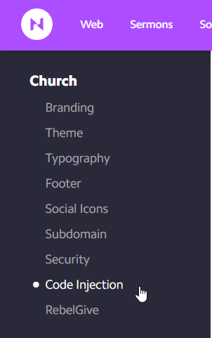
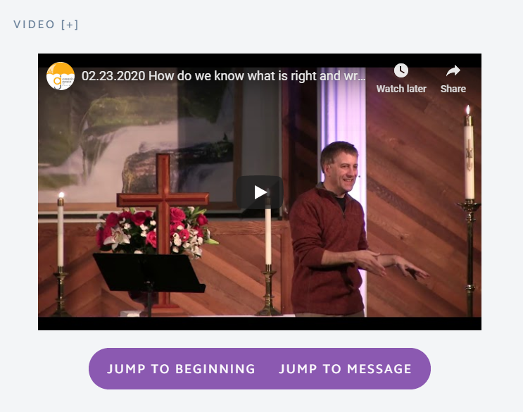
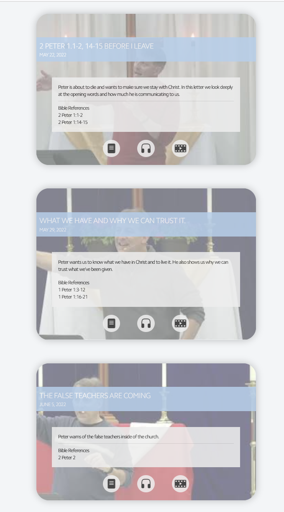

# Website Code

**Caveat: This page assumes you have knowledge of web programming.**

Currently we use [Nucleus](http://nucleus.church) as our website builder. It provides tools for building web pages (or "cards") using a simple drag-and-drop editor. Among the buildng blocks availble are HTML blocks which allow you to embed HTML code into a section of the page. This is used heavily for loading and displaying the resources from this GitHub project. It also provides finer control of the website's behavior via custom CSS and code-injection.

This page outlines the different web elements that make up the website.  It contains information about the styles, HTML blocks, and scripts that are used and how to utilize them using the website editor.

# CSS

Our site has a [custom CSS style sheet](../global_style.css). This provides styles for various custom elements to match the default website's element styles.

To accomplish this, a root style is provided that can be overriden on a per-page basis to allow for custom color schemes.

```css
:root {
    --bg-color-primary: #F9AF0D;
    --fg-color-primary: #FFFFFF;
    --border-color-primary: #00000000;
    --shadow-color: #F7B00680;
    --hover-bg-color: #FEE0AC;
    --active-bg-color: var(--bg-color-primary);
    --disabled-bg-color: lightgrey;
    --disabled-fg-color: grey;
    --disabled-border-color: darkgrey;
}
```
By providing a `:root{}` block in the page's custom CSS section, any one or more of these fields can be overriden.

# Code Injection

Nucleus provides the ability to inject code into every page. We use this to inject Google Analytics, JQuery, our custom CSS, and a few custom scripts.



This is our code injection block as of writing this:

```HTML
<!-- Global site tag (gtag.js) - Google Analytics -->
<script async src="https://www.googletagmanager.com/gtag/js?id=UA-66147796-1"></script>
<script>
    window.dataLayer = window.dataLayer || [];
    function gtag(){dataLayer.push(arguments);}
    gtag('js', new Date());

    gtag('config', 'UA-66147796-1');
</script>

<!-- JQuery -->
<script src="https://code.jquery.com/jquery-3.3.1.min.js" integrity="sha256-FgpCb/KJQlLNfOu91ta32o/NMZxltwRo8QtmkMRdAu8=" crossorigin="anonymous"></script>

<!-- Taylor's CSS -->
<link rel="stylesheet" href="https://amazinggracepdx.netlify.com/global_style.css">

<!-- Taylor's scripts -->
<script type="text/javascript" src="https://amazinggracepdx.netlify.com/barrier.js"></script>
<script type="text/javascript" src="https://amazinggracepdx.netlify.com/load_message_details.js"></script>
<script type="text/javascript" src="https://amazinggracepdx.netlify.com/load_youtube_iframe_api.js"></script>
```
**Note that the latter two load scripts only provide functions for loading resources - they don't actually initiate the load. See example in 
[Messages Front Page](##Messages-Front-Page)**

# Web Pages 

## Messages Front Page

This page contains links and embedded media players for the latest message video, audio, and notes. Each element consists of a `<div>` element that contains and `id` specifying its type and a `<script>` element to bind the data to it. For simplicity, in the website editor, each of the video, audio, and notes elements are contained in separate HTML blocks.

### Video Block

```html
<div align="center" class="" >
    <!-- YouTube iframe container -->
    <div class="ag-embed-responsive">
        <div id="latest-message-video" class="ag-embed-responsive-item"></div>
    </div>

    <!-- Controls for the YouTube player -->
    <div id="latest-message-video-controls" class="ag-btn-group ag-center" role="group" aria-label="Player controls">
        <button id="latest-message-video-controls-jump-to-beginning" type="button" class="ag-btn ag-btn-round">Jump To Beginning</button>
        <button id="latest-message-video-controls-jump-to-message" type="button" class="ag-btn ag-btn-round">Jump To Message</button>
    </div>
</div>
<script type="text/javascript" src="https://amazinggracepdx.netlify.com/latest_message_video.js"></script>
```



### Audio Block

```html
<div id="latest-message-audio" class="ag-center"></div>

<script type="text/javascript" src="https://amazinggracepdx.netlify.com/latest_message_audio.js"></script>
```


### Notes Block

```html
<div id="latest-message-notes" class="ag-center"></div>

<script type="text/javascript" src="https://amazinggracepdx.netlify.com/latest_message_notes.js"></script>
```


### Load Block

One final HTML block is required to be placed after all the other blocks. This block contains a simple `<script>` element that calls the *load* functions that acquire the data resources. At this point, all of the other scripts will have registered their callbacks with the relevant data loaders, so upon acquisition of the resources, each element will be populated.

```html
<script>
loadMessageDetails();
loadYouTubeIframeAPI();
</script>
```

This block requires *load_message_details.js* and *load_youtube_iframe.js* to be loaded before hand. This is done automatically by the [code injection](#Code-Injection).


The end result can be seen here: http://amazinggracepdx.com/messages-1

## Message Series Pages

Each message series has its own page. Each message in the series is is represented as a title with links to the video, audio, and notes.



The message series page is made up of two HTML blocks. The first is a section containing one `<div>` element for each message. The `class` must be `"message-block"`, and the `id` must be a date that matches a key in the database for the message. 

### Message Blocks

```html
<div id="2019-02-03" class="message-block"></div>
```

Multiple `<div>` elements may be placed on after the other to form a list of messages for the series.

```html
<div id="2019-02-03" class="message-block"></div>
<div id="2019-02-10" class="message-block"></div>
<div id="2019-02-17" class="message-block"></div>
<div id="2019-02-24" class="message-block"></div>
<div id="2019-03-10" class="message-block"></div>
```
### Load Block

In order for the data to be bound to the `<div>` elements, you must load the *load_message_series.js* script after the last element. 

```html
<script type="text/javascript" src="https://amazinggracepdx.netlify.com/message_series.js"></script>
```
This block requires *load_message_details.js* to be loaded before hand. This is done automatically by the [code injection](#Code-Injection).

For any missing link in the details for any particular message, the button for that link will be greyed out and disabled.

The end result can be seen here:
http://amazinggracepdx.com/jesus-mountainside-message

# A note on Netlifly

You may have noticed that the scripts are being loaded from https://amazinggracepdx.netlify.com. The way GitHub exposes its files, it  is non-trivial to load a javascript file as a script. To mitigate this, we use Netlifly which exposes GitHub repositories as web sites. Netlifly can serve an entire website, but  we only use it as a way to serve our scripts.
