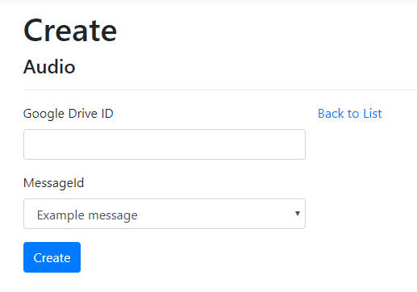
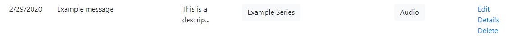

# Create an Audio Link

Go to the edit page from the home page, either from creating a new message or by clicking the *Edit* link on the far right of the message you want to edit from the home page.

Click on *Create New* next to Audio. 

Fill in the fields and click *Create*. Note, the Google Drive ID is the portion after the "id=" in the audio URL.

Now when you go back to the Messages page, the *Audio* link will be present for that message.

