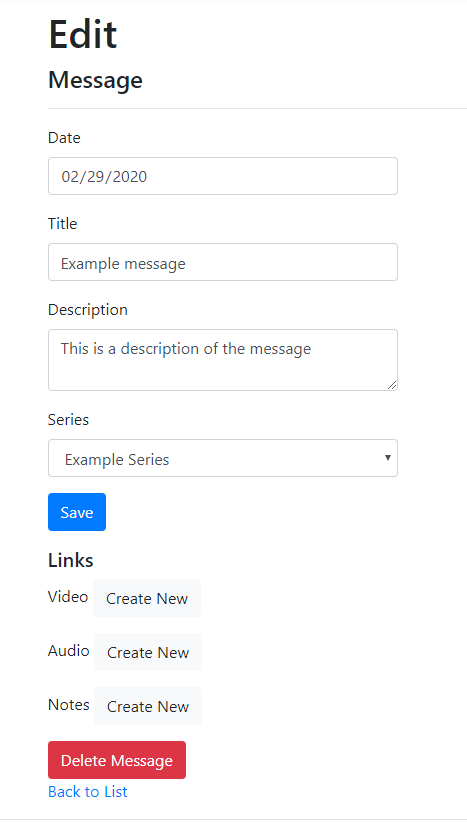

# Create a New Message

To create a new message, go to the home page (or navigate to *Messages* in the navigation pane).

Click *Add a New Message*

Fill in the following details:

* Date
* Title
* Description
* Series (for creating a series, see [Create a New Series](create-series.md))

Click *Create*

You will be redirected to the Edit page where you can modify the fields or add video, audio, or notes links. At this point, all of the fields are saved to the database.

When you are finished, click *Save* if you have made modifications. This will bring you back to the home page where you can see your newly-created message.

Next steps:
* [Create video link](create-video.md)
* [Create an audio link](create-audio.md)
* [Create a notes link](create-notes.md)
