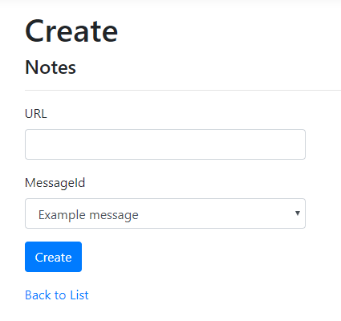
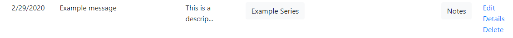

# Create an Notes Link

Go to the edit page from the home page, either from creating a new message or by clicking the *Edit* link on the far right of the message you want to edit from the home page.

Click on *Create New* next to Notes. 

Fill in the fields and click *Create*.

Now when you go back to the Messages page, the *Notes* link will be present for that message.

