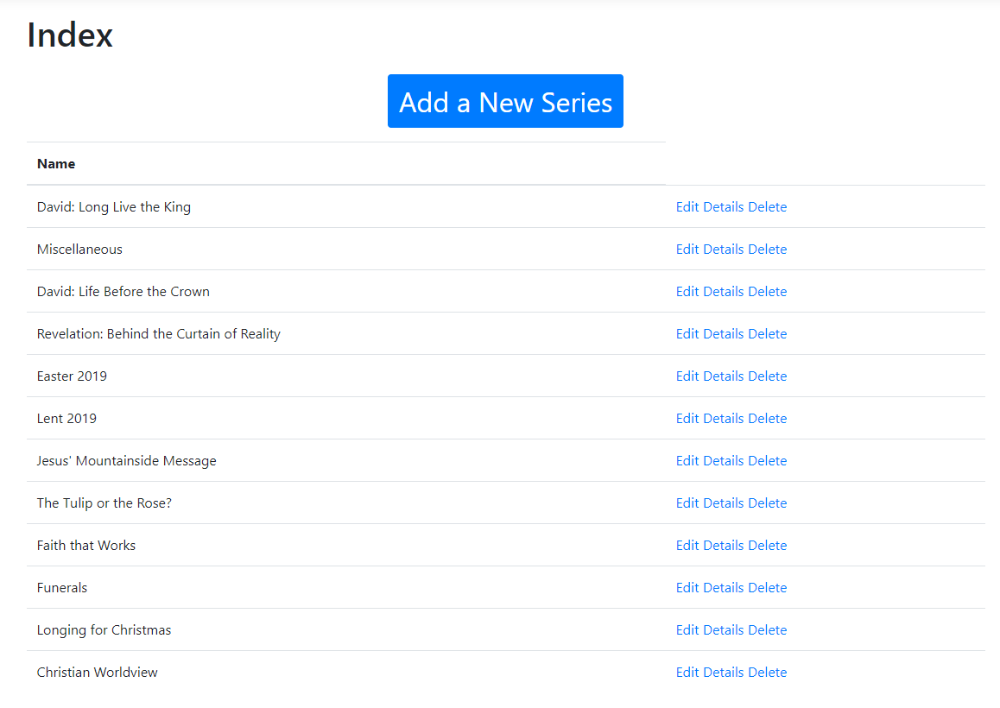
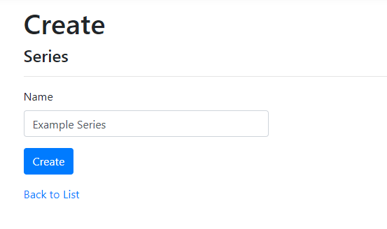
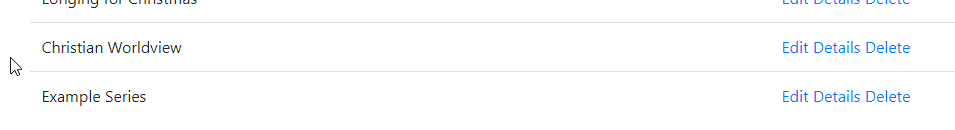

# Create a Series

To create a series, first navigate to the *Series* link at the top of the page.

This should bring you to the *Series* page, which lists all the existing series.

Click on *Add a New Series*

One you click *Create*, you will be redirected to the series page where you can see your newly created series.

From there, you can use the *Edit*/*Details*/*Delete* links to view or modify the new series.

Next, see [Create a New Message](create-message.md) for adding messages to the series.