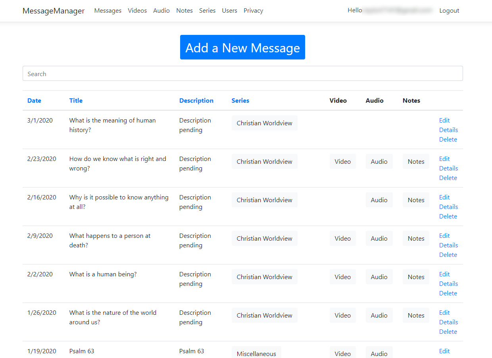

# MessageManager

The MessageManager is a new tool that allows you to add, edit, and view messages in the backing database. The manager is hosted on Azure at https://amazing-grace-pdx.azurewebsites.net/Messages.

Quick links:

* [Register a new user](register.md)
* [Create a series](create-series.md)
* [Create a message](create-message.md)
* [Create video link](create-video.md)
* [Create an audio link](create-audio.md)
* [Create a notes link](create-notes.md)

