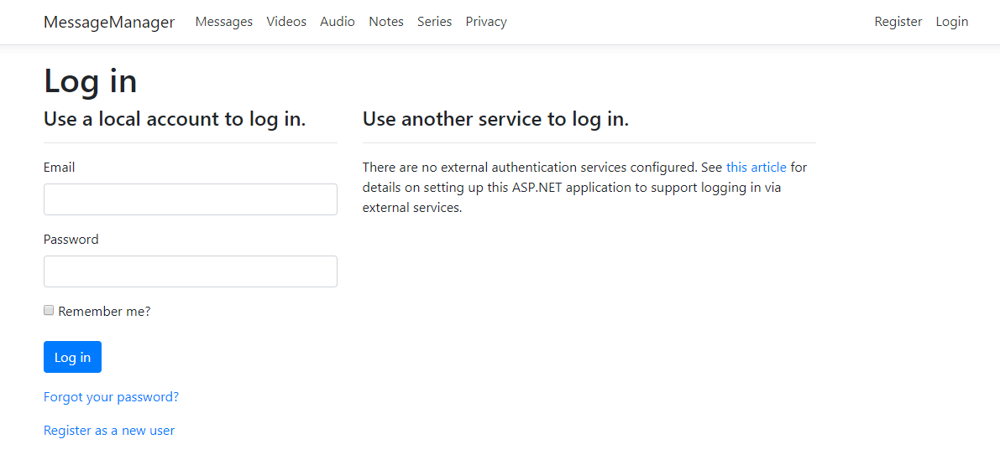
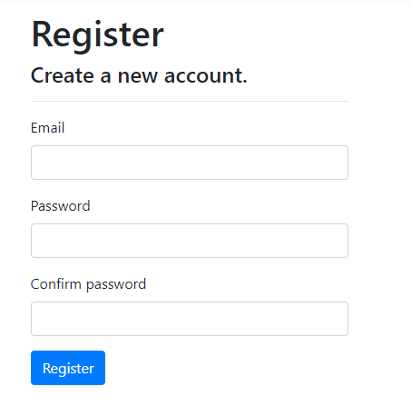

# Register a new user

Upon your first visit to the tool, you will be prompted to log in.

Unregistered users may still view and search the database by going to any of the links in the navigation pane, but may not add/edit/remove anything. In order to do these things, you must register as a user and request read/write access from the admin. 

To do register, click the *Register as a new user* link at the bottom of this page. Enter the credentials you would like to use for your account.

After registering, contact the admin to be given read/write access to the tool.
