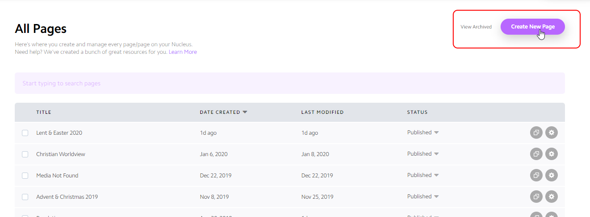
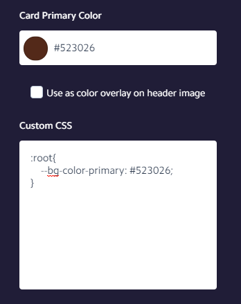
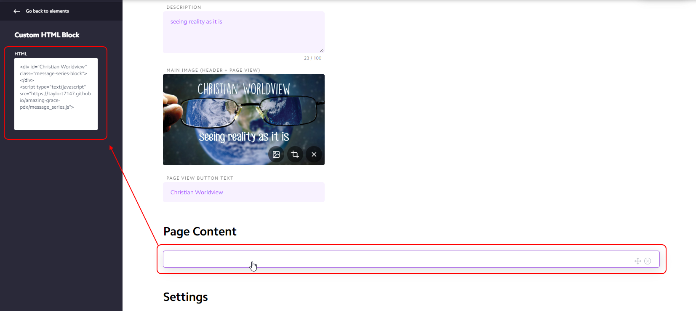

# Tutorial: Adding a new series

## Overview

1. [Add a new series to the database](#Add-a-new-series-to-the-database)
1. [Create a new card](#Create-a-new-card)
1. [Add an HTML block for the series](#Add-HTML-block)


## Add a new series to the database

See [Message Manager](message-manager/home.md), and [Create a New Series](message-manager/create-series.md).

## Create a new card

You can either [create a new card](http://help.nucleus.church/en/articles/1385441-create-new-card), or [duplicate an existing one](http://help.nucleus.church/en/articles/1384961-duplicate-card).



Once you have created the card, set up the theme color by going to the settings at the bottom of the page. 




To make the elements from this project match the theme, enter the following into the *Custom CSS* block below the *Card Primary Color*, replacing the hexadecimal number representing the color (`#61ADEB`) with the color chosen for the theme.

```css
:root{
    --bg-color-primary: #61ADEB;
}
```


## Add HTML block

Add one HTML block and paste the contents of this code example into the block, being sure to replace the `id` attribute with the name of the series as it exists in the database. See [Message Series Pages](description-website-code.md#Message-Series-Pages) for more details on how this HTML block works.

```html
<div id="Christian Worldview"  class="message-series-block"></div>

<script type="text/javascript" src="https://taylort7147.github.io/amazing-grace-pdx/message_series.js">
```



**Unfortunately, Nucleus doesn't display a good preview of these HTML blocks in the editor, so they'll just look like empty HTML blocks until you open the preview.**
