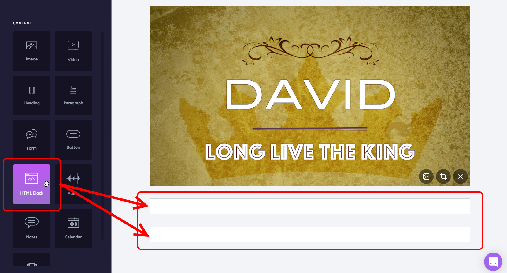

# Tutorial: Adding a new series

## Overview

1. [Create a new card](#Create-a-new-card)
2. [Add HTML blocks for the messages](#Add-HTML-blocks)
2. [Add placeholders in the database](#Add-placeholders-in-the-database)

## Create a new card

-- TODO -- 

## Add HTML blocks

Add two HTML blocks - one for the message `<div>` elements, and one for the `<script>` element.



### Message block `<div>` elements


HTML block code:
```html
<div id="2019-06-16" class="message-block"></div>
<div id="2019-06-23" class="message-block"></div>
<div id="2019-06-30" class="message-block"></div>
<div id="2019-07-07" class="message-block"></div>
<div id="2019-07-14" class="message-block"></div>
<div id="2019-07-21" class="message-block"></div>
<div id="2019-07-28" class="message-block"></div>
<div id="2019-08-04" class="message-block"></div>
<div id="2019-08-11" class="message-block"></div>
<div id="2019-08-18" class="message-block"></div>
```
### Load `<script>` element


HTML block code:
```html
<script type="text/javascript" src="https://amazinggracepdx.netlify.com/message_series.js">
```

## Add placeholders in the database

Now add one element per message to the [database](../message_details.json), making sure to fill in at least the *date* key, *title*, and *description*.

```json
    "2019-06-16" : {
        "title": "God's Where, God's When",
        "videoId": "",
        "playlistId": "",
        "description": "",
        "messageStart": 0,
        "tags" : [],
        "audioLink": "",
        "audioDownloadLink": "",
        "notesLink": ""
    },
    "2019-06-23" : {
        "title": "The Seeds We Sow",
        "videoId": "",
        "playlistId": "",
        "description": "2 Samuel 3:2-39",
        "messageStart": 0,
        "tags" : [],
        "audioLink": "",
        "audioDownloadLink": "",
        "notesLink": ""
       },
    "2019-06-30" : {
        "title": "Long Live the King!",
        "videoId": "",
        "playlistId": "",
        "description": "2 Samuel 5:1-16",
        "messageStart": 0,
        "tags" : [],
        "audioLink": "",
        "audioDownloadLink": "",
        "notesLink": ""
    },
    "2019-07-07" : {
        "title": "David's Mighty Men",
        "videoId": "",
        "playlistId": "",
        "description": "2 Samuel 5:17-25, 23:8-39",
        "messageStart": 0,
        "tags" : [],
        "audioLink": "",
        "audioDownloadLink": "",
        "notesLink": ""
    },
    "2019-07-14" : {
        "title": "Can Man Live With God?",
        "videoId": "",
        "playlistId": "",
        "description": "2 Samuel 6:1-11",
        "messageStart": 0,
        "tags" : [],
        "audioLink": "",
        "audioDownloadLink": "",
        "notesLink": ""
    },
    "2019-07-21" : {
        "title": "David's Dance",
        "videoId": "",
        "playlistId": "",
        "description": "2 Samuel 6:12-23",
        "messageStart": 0,
        "tags" : [],
        "audioLink": "",
        "audioDownloadLink": "",
        "notesLink": ""
    },
    "2019-07-28" : {
        "title": "David's Son, David's Lord",
        "videoId": "",
        "playlistId": "",
        "description": "2 Samuel 7:1-17",
        "messageStart": 0,
        "tags" : [],
        "audioLink": "",
        "audioDownloadLink": "",
        "notesLink": ""
    },
    "2019-08-04" : {
        "title": "David's Prayer",
        "videoId": "",
        "playlistId": "",
        "description": "2 Samuel 7:18-29",
        "messageStart": 0,
        "tags" : [],
        "audioLink": "",
        "audioDownloadLink": "",
        "notesLink": ""
    },
    "2019-08-11" : {
        "title": "Power and Promise",
        "videoId": "",
        "playlistId": "",
        "description": "2 Samuel 8-9",
        "messageStart": 0,
        "tags" : [],
        "audioLink": "",
        "audioDownloadLink": "",
        "notesLink": ""
    },
    "2019-08-18" : {
        "title": "The Ammonite War",
        "videoId": "",
        "playlistId": "",
        "description": "2 Samuel 10",
        "messageStart": 0,
        "tags" : [],
        "audioLink": "",
        "audioDownloadLink": "",
        "notesLink": ""
    }
```

**Unfortunately, Nucleus doesn't display a good preview of these HTML blocks, so they'll just look like empty HTML blocks until you open the preview.**

### Publish the changes

See [Publishing changes](tutorial-publishing-changes.md)


