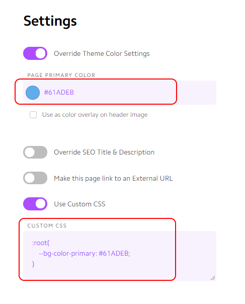

# Tutorial: Adding a new series

## Overview

1. [Create a new card](#Create-a-new-card)
2. [Add HTML blocks for the messages](#Add-HTML-blocks)
2. [Add placeholders in the database](#Add-placeholders-in-the-database)


## Create a new card

You can either [create a new card](http://help.nucleus.church/en/articles/1385441-create-new-card), or [duplicate an existing one](http://help.nucleus.church/en/articles/1384961-duplicate-card).


Once you have created the card, set up the theme color by going to settings. 


In the left-hand panel, scroll down to *Card Primary Color*. Select the color you want for this card. This sets up the theme color for all the applicable Nucleus elements. 



To make the elements from this project match the theme, enter the following into the *Custom CSS* block just below the *Card Primary Color*, replacing the hexadecimal number representing the color (`#523026`) with the color chosen for the theme.

```css
:root{
    --bg-color-primary: #523026;
}
```


## Add HTML blocks

Add two HTML blocks - one for the message `<div>` elements, and one for the `<script>` element.


### Message block `<div>` elements


In this block, create one `<div>` element for each message in the series. The `id` is the date of the message, which will be used to bind the data to the element. The `class="message-block"` tells our loading script to create a series of buttons for this `<div>`, which will be enabled automatically with the links from the database when available.

HTML block code:
```html
<div id="2019-06-16" class="message-block"></div>
<div id="2019-06-23" class="message-block"></div>
<div id="2019-06-30" class="message-block"></div>
<div id="2019-07-07" class="message-block"></div>
<div id="2019-07-14" class="message-block"></div>
<div id="2019-07-21" class="message-block"></div>
<div id="2019-07-28" class="message-block"></div>
<div id="2019-08-04" class="message-block"></div>
<div id="2019-08-11" class="message-block"></div>
<div id="2019-08-18" class="message-block"></div>
```
### Load `<script>` element


This block executes a script from this project that loads the database and binds the data to the matching `<div>`s from the block above. Technically, both these blocks could be one, but separating them makes it more clear what each block does.

**This block will be *exactly* the same for every message series**

HTML block code:
```html
<script type="text/javascript" src="https://amazinggracepdx.netlify.com/message_series.js">
```


## Add placeholders in the database

Now add one element per message to the [database](../message_details.json), making sure to fill in at least the *date* key, *title*, and *description*. Until these placeholders exist and the file changes committed to the repo, none of the message series blocks will be visible on the website (or preview).

```json
    "2019-06-16" : {
        "title": "God's Where, God's When",
        "videoId": "",
        "playlistId": "",
        "description": "",
        "messageStart": 0,
        "tags" : [],
        "audioLink": "",
        "audioDownloadLink": "",
        "notesLink": ""
    },
    "2019-06-23" : {
        "title": "The Seeds We Sow",
        "videoId": "",
        "playlistId": "",
        "description": "2 Samuel 3:2-39",
        "messageStart": 0,
        "tags" : [],
        "audioLink": "",
        "audioDownloadLink": "",
        "notesLink": ""
       },
    "2019-06-30" : {
        "title": "Long Live the King!",
        "videoId": "",
        "playlistId": "",
        "description": "2 Samuel 5:1-16",
        "messageStart": 0,
        "tags" : [],
        "audioLink": "",
        "audioDownloadLink": "",
        "notesLink": ""
    },
    "2019-07-07" : {
        "title": "David's Mighty Men",
        "videoId": "",
        "playlistId": "",
        "description": "2 Samuel 5:17-25, 23:8-39",
        "messageStart": 0,
        "tags" : [],
        "audioLink": "",
        "audioDownloadLink": "",
        "notesLink": ""
    },
    "2019-07-14" : {
        "title": "Can Man Live With God?",
        "videoId": "",
        "playlistId": "",
        "description": "2 Samuel 6:1-11",
        "messageStart": 0,
        "tags" : [],
        "audioLink": "",
        "audioDownloadLink": "",
        "notesLink": ""
    },
    "2019-07-21" : {
        "title": "David's Dance",
        "videoId": "",
        "playlistId": "",
        "description": "2 Samuel 6:12-23",
        "messageStart": 0,
        "tags" : [],
        "audioLink": "",
        "audioDownloadLink": "",
        "notesLink": ""
    },
    "2019-07-28" : {
        "title": "David's Son, David's Lord",
        "videoId": "",
        "playlistId": "",
        "description": "2 Samuel 7:1-17",
        "messageStart": 0,
        "tags" : [],
        "audioLink": "",
        "audioDownloadLink": "",
        "notesLink": ""
    },
    "2019-08-04" : {
        "title": "David's Prayer",
        "videoId": "",
        "playlistId": "",
        "description": "2 Samuel 7:18-29",
        "messageStart": 0,
        "tags" : [],
        "audioLink": "",
        "audioDownloadLink": "",
        "notesLink": ""
    },
    "2019-08-11" : {
        "title": "Power and Promise",
        "videoId": "",
        "playlistId": "",
        "description": "2 Samuel 8-9",
        "messageStart": 0,
        "tags" : [],
        "audioLink": "",
        "audioDownloadLink": "",
        "notesLink": ""
    },
    "2019-08-18" : {
        "title": "The Ammonite War",
        "videoId": "",
        "playlistId": "",
        "description": "2 Samuel 10",
        "messageStart": 0,
        "tags" : [],
        "audioLink": "",
        "audioDownloadLink": "",
        "notesLink": ""
    }
```

**Unfortunately, Nucleus doesn't display a good preview of these HTML blocks, so they'll just look like empty HTML blocks until you open the preview.**

### Publish the changes

See [Publishing changes](tutorial-publishing-changes.md)


