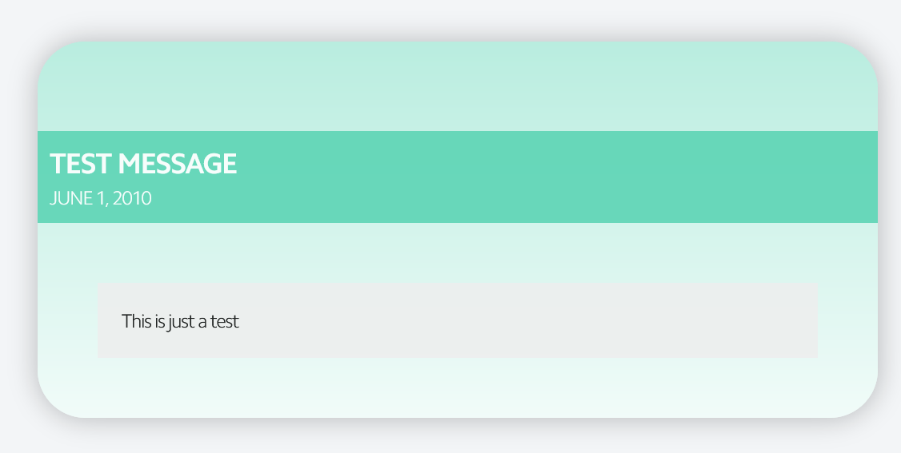

# Tutorial: Weekly upload

## Overview

1. [Upload video, audio, and notes](#Upload-video,-audio,-and-notes)
1. [Add details to the database](#Add-the-details-to-the-database)

## Upload video, audio, and notes

* Video
    * Trim the video to capture the entire service
        * Start at introduction before first hymn
        * End just after the announcments
        * Don't include music videos before or after the service
        * Name the file according to the format ***YYYY-MM-DD*_service.mp4**
    * Upload video to YouTube using Amazing Grace's account
        * Set the *Title* according to the format **MM.DD.YYYY Title**
        * Set the *Description* to include the Bible passage(s) and optionally a short description of the message
        * Set the *Playlist* to the sermon series name
        * Set the *Recording Date* to the date of the service
        * Make sure the *Visibility* is *Public*
        * Add any *Tags* that pertain to the service.

* Audio
    * Trim audio to capture just the sermon message
        * Name the file according to the format ***YYYY-MM-DD*_sermon.mp3**
    * Upload the file to Amazing Grace's Google Drive folder under **Sermon Audios/*Series Name***

* Notes
    * Notes should be uploaded as a PDF
        * Pastor usually takes care of this

## Add the details to the database

This tutorial assumes you have set up the sermon series in the database ahead of time, so you should have an existing entry for each message in the sermon series. If you haven't then refer back to [this tutorial](tutorial-adding-a-new-series.md).

Before adding any of the links, the video, audio, and notes buttons will be disabled since all the links are empty. There will also be no background image, as that is retrieved from the YouTube thumbnails. Instead, the background will be a gradient of primary background color to white by default.

### Gather the details
---
Get the video ID from the YouTube video URL. 

#### Example:

URL: 
    
    https://www.youtube.com/watch?v=mWH1jVwcjuM

Video ID:
    
    mWH1jVwcjuM
---

Get the playlist ID from the playlist's URL.

#### Example:

URL:

    https://www.youtube.com/watch?v=mWH1jVwcjuM&list=PLfBOebmxfChGt7oRuCD2MvX_ZB3WltQE7

Playlist ID:

    PLfBOebmxfChGt7oRuCD2MvX_ZB3WltQE7
---

Find out what time in seconds the message starts (usually after the first hymn). In this case, the message starts at 3:45.

---

From the Google Drive web interface, get the link for the audio file by right-clicking on the file and selecting **Get shareable link**

This will give you the link to play the file.

Audio Link:

    https://drive.google.com/open?id=1ThZTdv-HXmDYuqLZxszIQMECSgffpgWA
    or
    https://drive.google.com/file/d/1ThZTdv-HXmDYuqLZxszIQMECSgffpgWA/view?usp=sharing

From the audio link, get extract the ID:

    1ThZTdv-HXmDYuqLZxszIQMECSgffpgWA
    
---

### Update the database

Once you have all the details, you can use the Message Manager to update the database. See [Message Manager](message-manager/home.md), and [Create a New Message](message-manager/create-message.md).